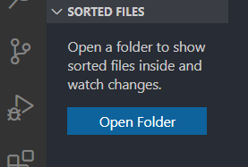
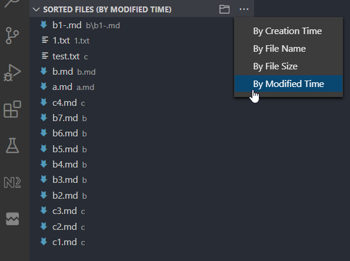

# Sorted Files
This simple extension is based on vscode tree-view-sample to display only files of a folder in a tree view. By default the files are sorted by modified time so it's convenient to know the recently modified files in the specified folder. E.g. if you use vscode to manage your markdown files in a folder you may want to know which files are recently modified in that folder. The similar idea also applies to other file types.

## Features

1). Watch for specified folder for changes

2). Sort files based on file's

- Modified time
- Creation time
- File names(full path)
- File sizes

3). Ascending and descending order

Toggle when clicking current order menu item.

## Extension Settings

This extension contributes the following settings:

* `sortedFiles.maxItems`: max files shown in view
* `sortedFiles.pattern`: regex pattern for choosing files. E.g.
  * `\.md$` to choose *.md files
  * `\.md$|\.java$` to choose *.md and *.java files

## Release Notes

### 1.0.0

Initial release of Sorted Files

